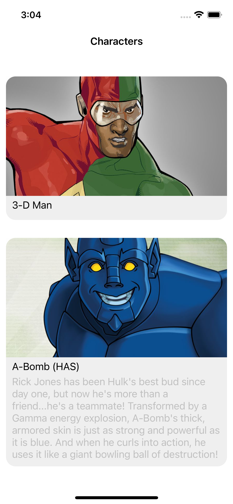

<h1 align="center">Marvels</h1>
<h3 align="center">An iOS application to display list of Marvel characters.</h3>

## About

This repository includes an iOS application to display the list of Marvel charcaters and character in detail.
The main purpose of this project is to develop an app in swift language using MVVM architecture, using xibs, integrates Marvel API's and also taken measures to avoid using of third parties.

## Screens

- **Characters List:** displays list of characters with their thumbnails, names and descriptions.
- **Character Detail:** displays picture of a character, name, and it's full description.

  
  

## Architecture

This app has been developed using a simple MVVM architectural pattern. The app has three major layers: 
- The **Presentation** layer, which contains the views and other UIKit-related units.
- The **Domain** layer, which contains the business logic and use cases.
- The **Data** layer, which contains the models and authentication logic needed to connect to the Marvel API.

### Tests

This app has a bunch of unit tests. Models and authentication logic has been tested. 

- **Marvel API keys**: Set your Marvel API keys as environment variables. Go to schemes, Marvel, and select Edit Scheme. Then, insert the environment variables into Run option -> Arguments -> Environment Variables.

  

